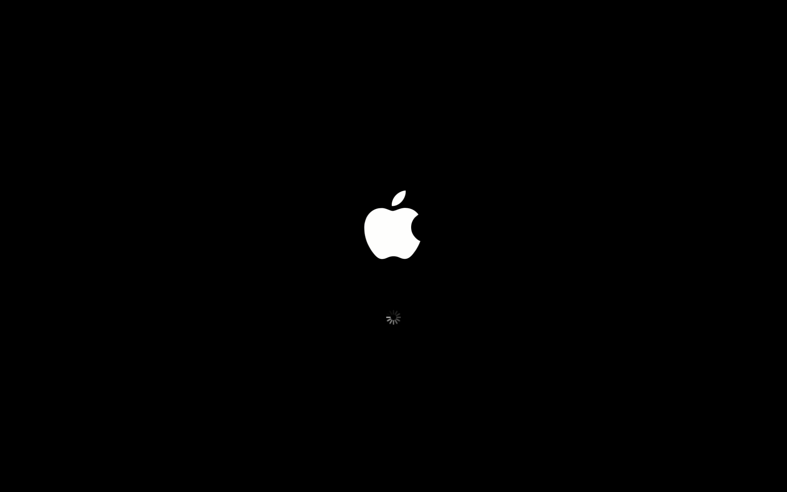

# **Simple Apple Plymouth Theme**

## Background Information

_The original project was created by [Navis Michael Bearly](https://github.com/navisjayaseelan)_

_But the [project](https://github.com/navisjayaseelan/apple-mac-plymouth) hasn't been maintained for a long time._

## **How to install it?**

    git clone https://github.com/supdrewin/simple-apple-plymouth.git
    cd simple-apple-plymouth
    sudo ./installer

## **How to remove it?**

    sudo ./installer -r

- _If you want to reinstall it, just type `sudo ./installer -R` !_

## Help to fix issues

- Click [Here](https://github.com/supdrewin/simple-apple-plymouth/issues) to report issues
- Click [Here](https://github.com/supdrewin/simple-apple-plymouth/pulls) to pull requests
